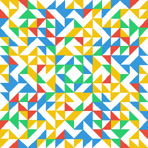

========

HashIcon is a PHP Class which generate unique icon based on a hash.  
Icons are generated in a Base64 format.

Functions
---------
``` php
function toIcon($algo, $hash, $size = 300, $format = 'png');
```

Usage
-------
``` php
require 'HashIcon.php';

$hash  = hash('sha256', 'Lorem ipsum dolor sit amet.');
$image = HashIcon::toIcon(HashIcon::SHA256, $hash);

header('Content-type:image/png');
echo base64_decode($image);

// or ">
```



Accepted algorythms
-------------------
- HAVAL-256,3
- HAVAL-256,4
- HAVAL-256,5
- GOST
- RIPEMD-256
- SHA-256
- Snefru

Accepted formats
----------------
- PNG
- JPG
- GIF

TODO-LIST
---------
Add a reverse function : `HashIcon::toHash()`.  
Add algorythms :
- Adler-32
- CRC-32
- CRC-32B
- MD2
- MD4
- MD5
- HAVAL-128,3
- HAVAL-128,4
- HAVAL-128,5
- HAVAL-160,3
- HAVAL-160,4
- HAVAL-160,5
- HAVAL-192,3
- HAVAL-192,4
- HAVAL-192,5
- HAVAL-224,3
- HAVAL-224,4
- HAVAL-224,5
- RIPEMD-128
- RIPEMD-160
- RIPEMD-320
- Tiger-128,3
- Tiger-128,4
- Tiger-160,3
- Tiger-160,4
- Tiger-192,3
- Tiger-192,4
- SHA-1
- SHA-384
- SHA-512
- Whirlpool